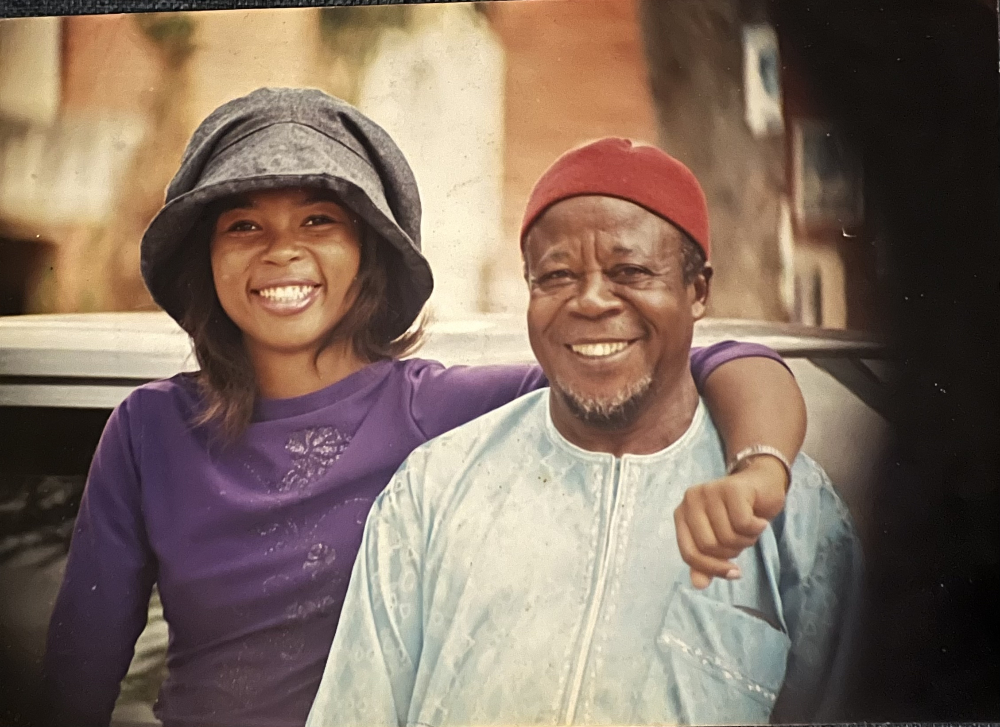

### Thank You! 

With heartfelt gratitude, we acknowledge the many hands, hearts, and voices that made Footprints in Moving Sands possible. This tribute book is the result of a collective effort rooted in love, admiration, and profound respect for the life and legacy of Prof. Ardo Chimah Ezeomah.
We thank the family, friends, colleagues, former students, and community members who shared their memories, reflections, and archival materials. Your contributions helped illuminate the depth and breadth of his impact across generations and communities.
Our appreciation goes to the institutions he served, the University of Jos, the National Commission for Nomadic Education, and the many educational and development bodies that partnered with him. Your preservation of his work and recognition of his contributions made it possible to present an accurate and meaningful account of his professional journey.
A special acknowledgment is extended to those who offered emotional support, encouragement, and patience throughout the creation of this book. Your kindness and solidarity sustained us through a difficult season of grief, allowing this project to take shape with dignity and purpose.
Finally, we honour the nomadic communities whose warmth, trust, and collaboration shaped much of Prof. Ezeomah’s life work. This book celebrates not only his legacy but also the resilience, intelligence, and spirit of the people he devoted his life to uplifting.
To everyone who walked with us on this journey: thank you. Your contributions ensure that his footprints remain visible, meaningful, and inspirational in the moving sands of time.

– Chiomah Ezeomah, Curator