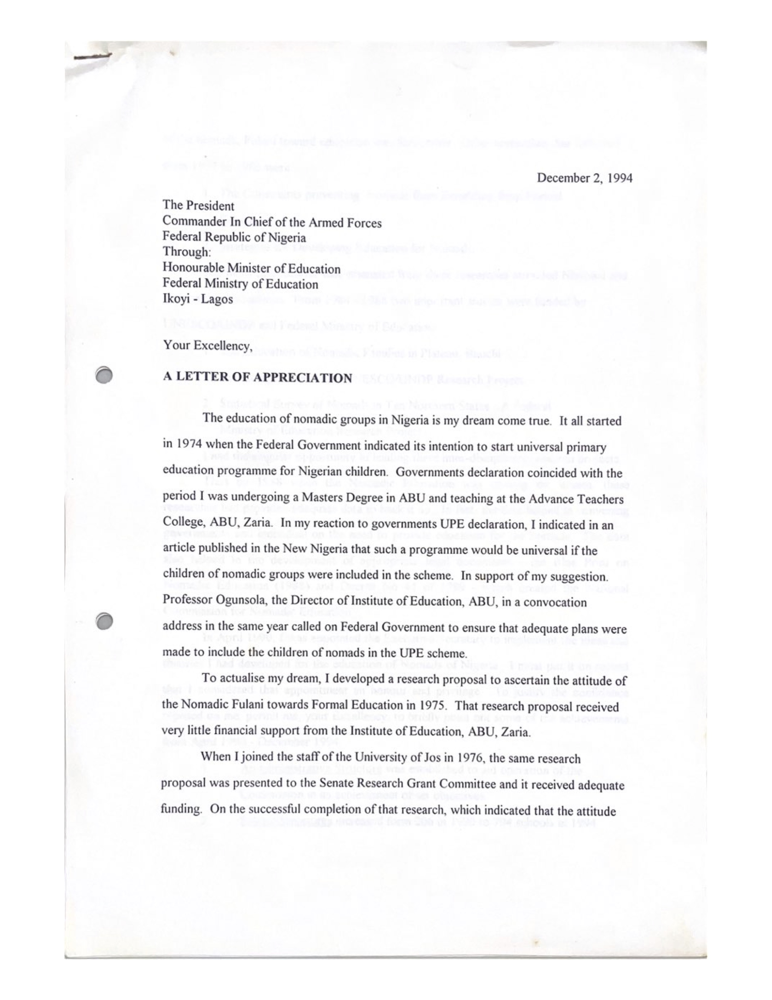
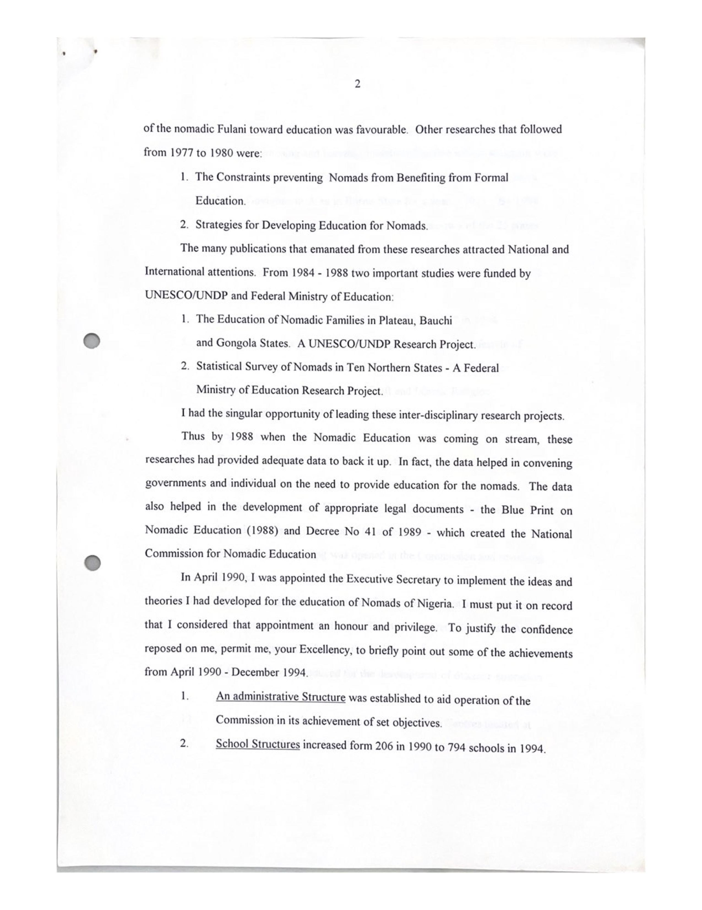
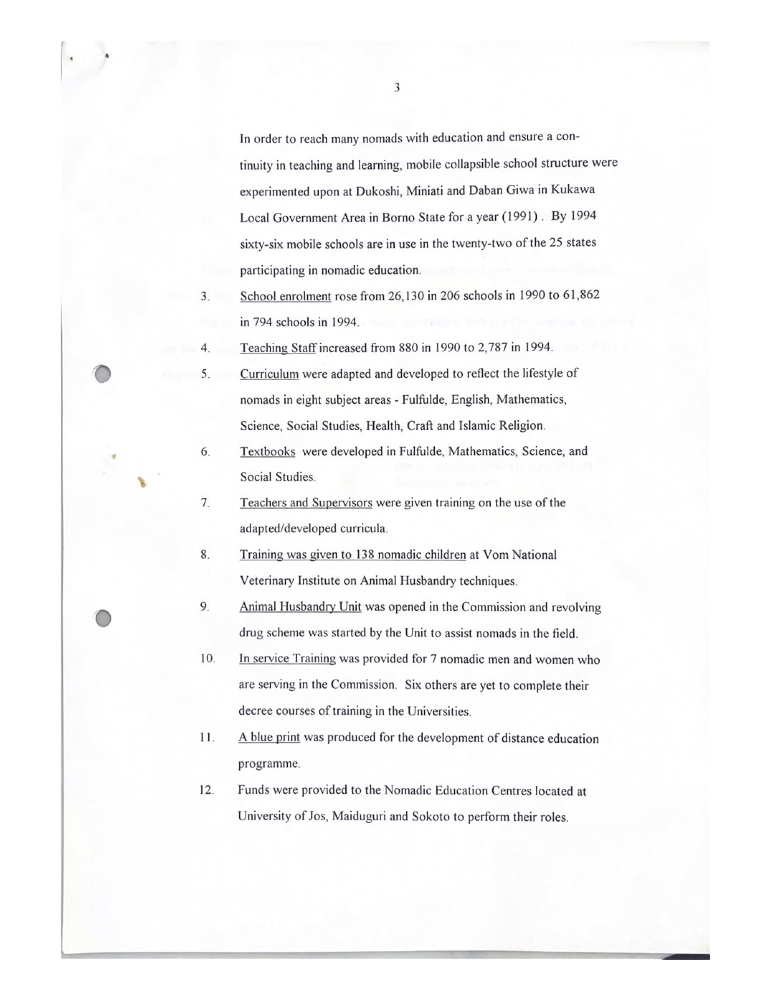
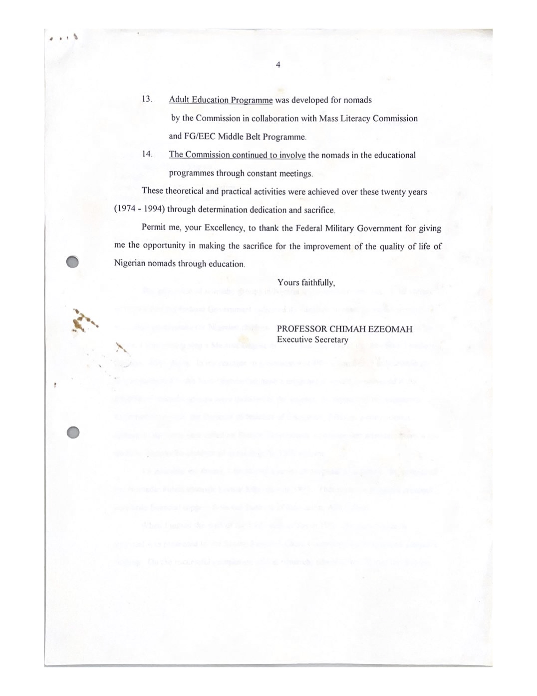

<h3 class="center-title">Official Launch of the FCT Chapter of the Nomadic Education Programme, Tuesday, July 12, 1988</h3>

  <iframe 
    src="pdfs/fctchapterlaunchnomadic1988.pdf#view=FitH" 
    width="100%" 
    height="600px" 
    style="border:1px solid #556B2F; border-radius:10px;">
  </iframe>

<h3 class="center-title">Unsigned Version of Valedictory Letter to the President at the Conclusion of Tenure as Inaugural Executive Secretary, National Commission for Nomadic Education (1994)</h3>

  
  
  
  

