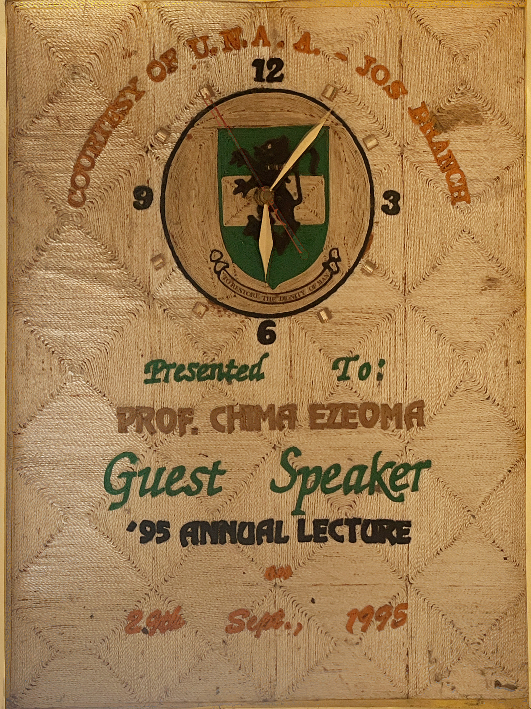

<h3 class="center-title">UNESCO/UNDP Award</h3>

  

<h3 class="center-title">University of Nsukka Alumni Award of Excellence</h3>

  

<h3 class="center-title">University of Nigeria, Nsukka Alumni Association - Jos Branch; Guest Speaker, 1995 Annual Lecture (September 29, 1995)</h3>

  

