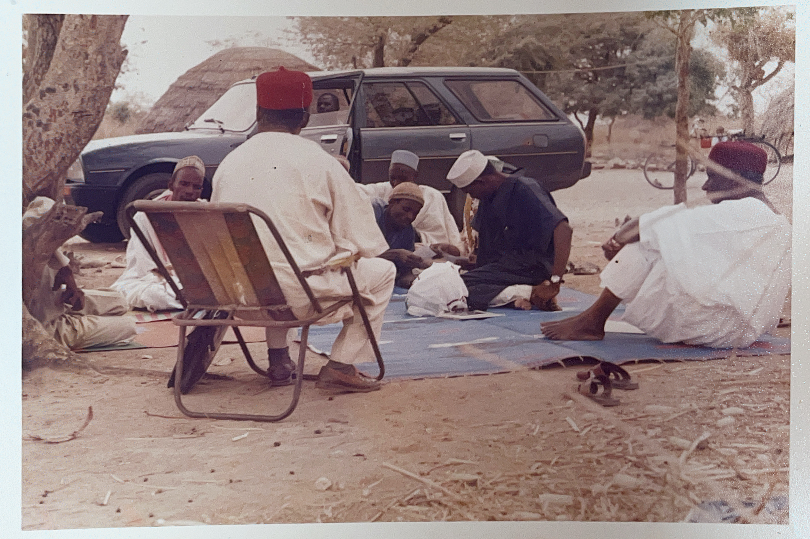

<h3 class="center-title">Curator's Notes</h3>

The primary purpose of preparing this professional tribute book, *Footprints in Moving Sands*, is to offer the world a carefully curated glimpse into the extraordinary life and legacy of Prof. Ardo Chimah Ezeomah. In these pages, we gather the footsteps of a man who devoted over five decades to expanding the boundaries of access, dignity, and possibility through education, especially for children and communities too often overlooked.

This book is not merely a record of dates, achievements, or accolades. It is a tapestry of memories, testimonies, and stories that together reveal the depth of his humanity: his passion for teaching, his pioneering scholarship in nomadic education, his steadfast service to Nigeria, his humanitarian endeavors and his remarkable ability to connect with people across culture, class, and circumstance.

Our hope is that this collection will inspire future generations of students, scholars, educators, mentors, innovators, policymakers, and government leaders, to embody some of the values he championed: empathy, courage, intellectual honesty, justice, and a belief that education is a bridge every child deserves the chance to cross.

In honoring him, we also honor the ideals he lived for. May this book stand as a guidepost, a source of reflection, and a reminder that even in shifting sands, some footprints remain—clear, steady, and transformative.

This has been a difficult time of mourning the loss of my father, friend, mentor, cheer-leader, inspiration, and the man who constantly pushed me to be better. Writing a personal tribute has been challenging for me, so I decided instead to dedicate my time and skillset to curating my father’s legacy through this tribute book and his professional memorial website: https://profardochimahezeomah.github.io, with the hope that it will inspire future generations.

\- Curator: Chiomah Ezeomah, B.A. & B.S. (Uni at Buffalo); MSc (Cornell); MSc (Oxford).

**NOTE:** If you would like to add a tribute, or other relevant documents or professional memories to this memorial website, please kindly reach out to Chiomah Ezeomah using chiomah.ezeomah@gmail.com 
