

### University of Jos

  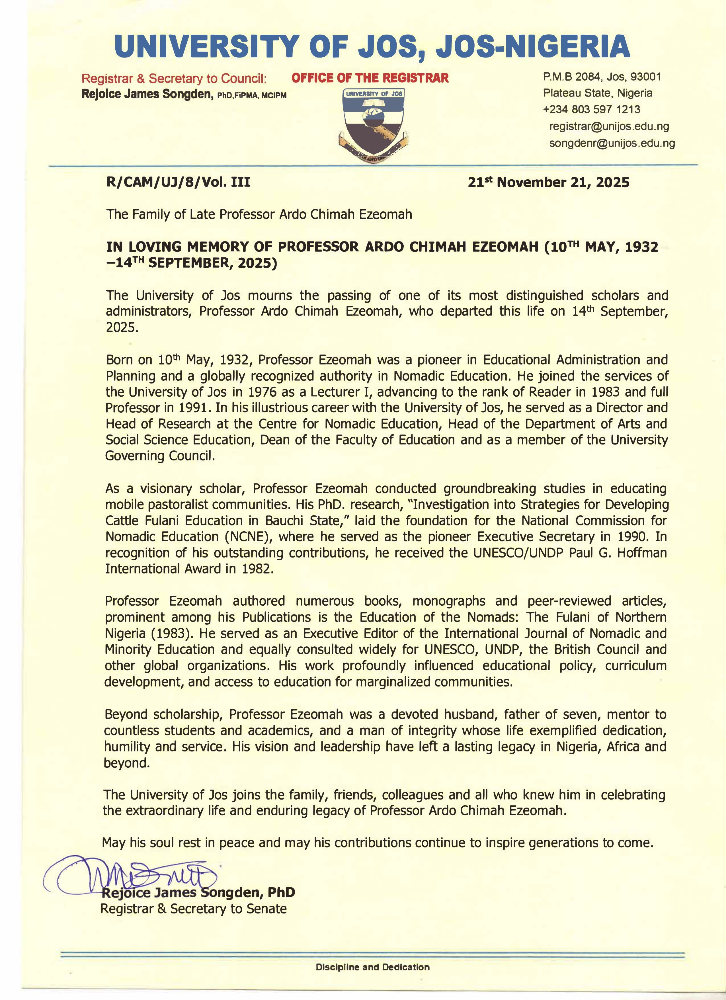

### National Commission for Nomadic Education

  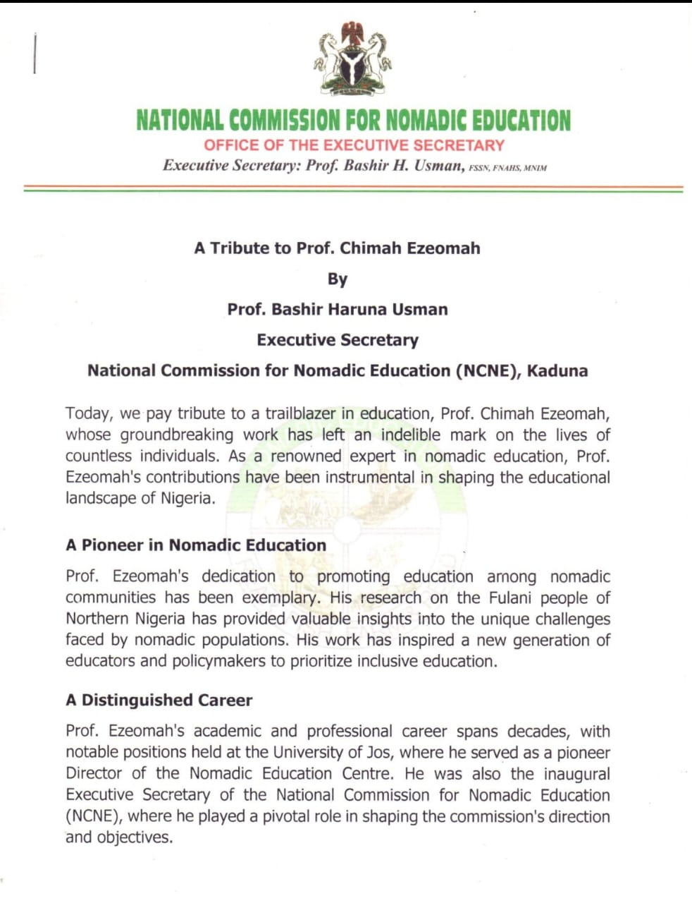
  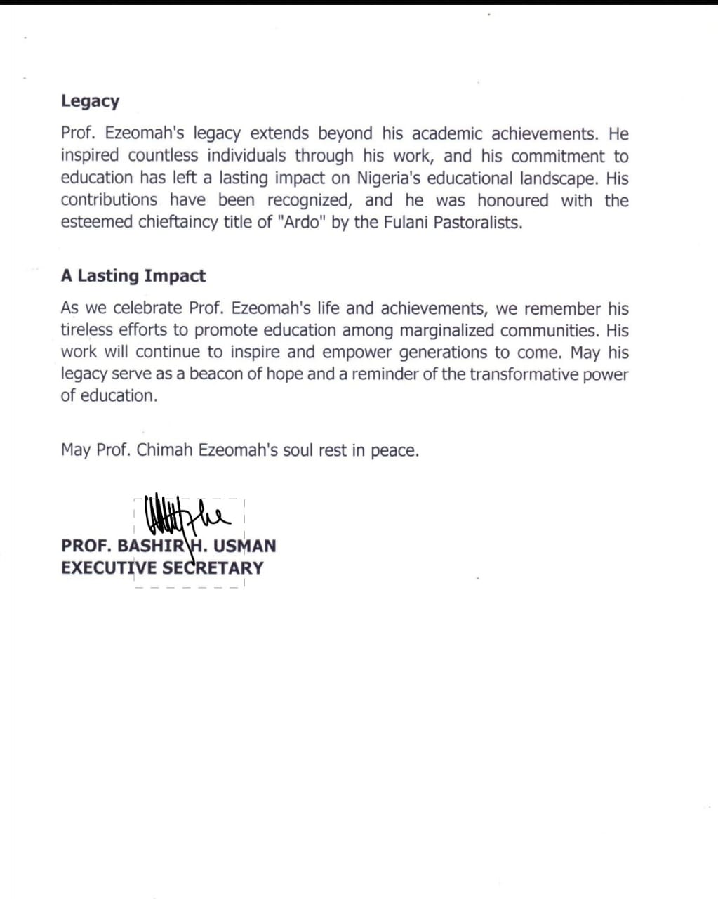

### Dean, Faculty of Education, University of Jos

  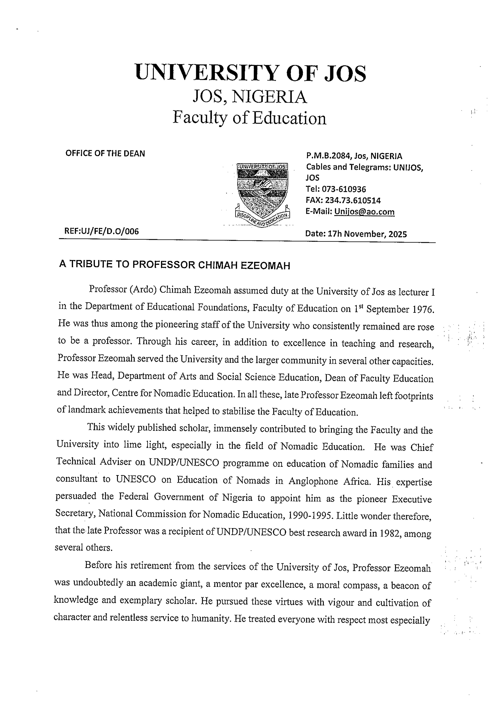
  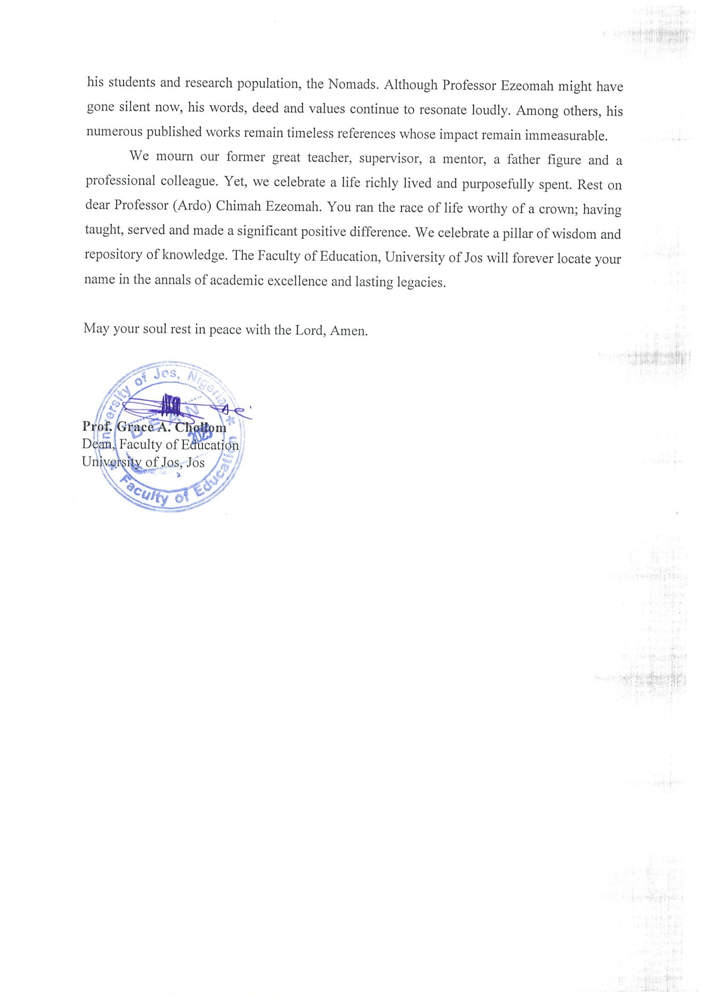

### Honorable Justice Chidiebere Nwaoma Uwa, JSC

  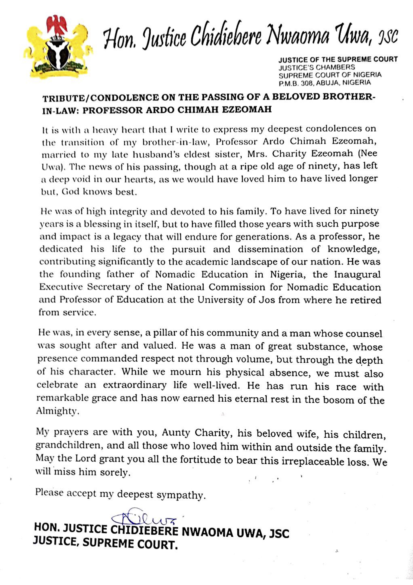

### Professor (Mrs) Viola Adaku Onwuliri 

  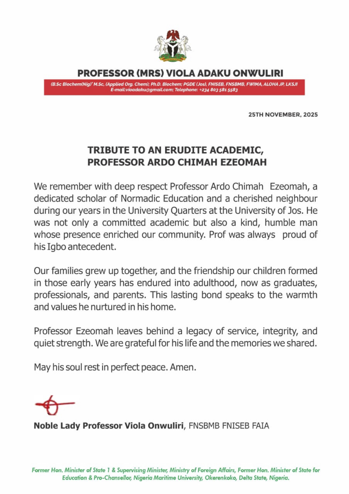

### Ambassador (Prof) Mary N. Lar, OON

  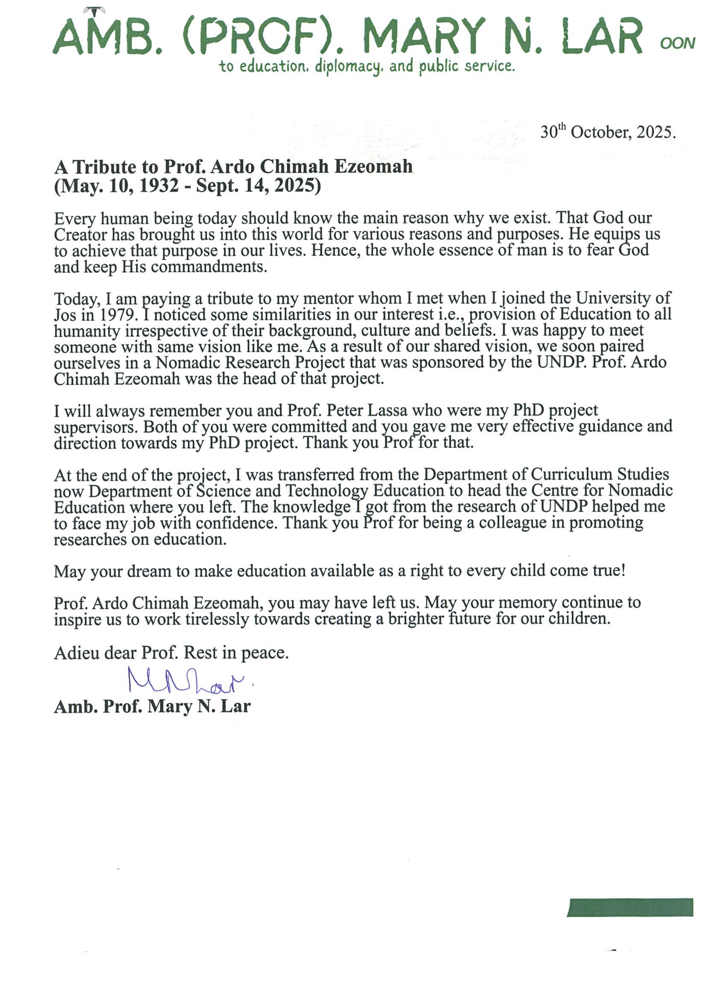

### Honorable (Dr) Kachallom Gang

  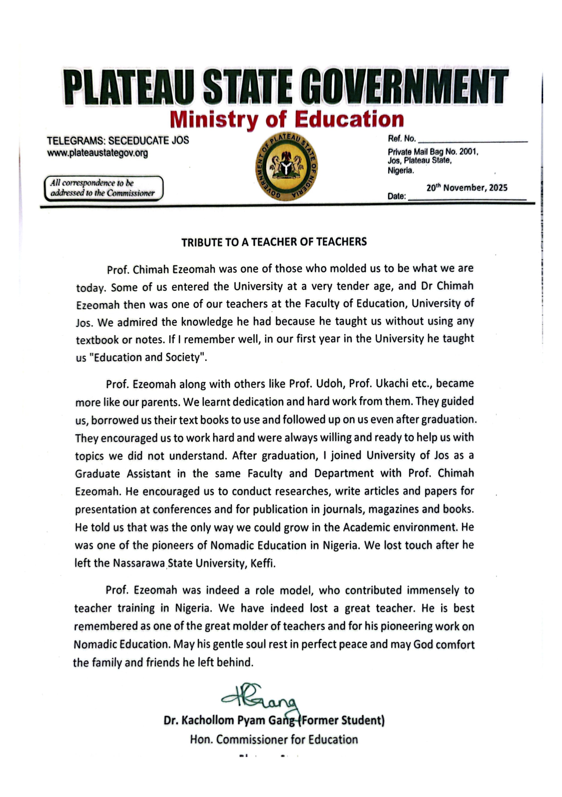

### Brig. General Kingsley Chidiebere Uwa

  

    <strong>Tribute to Late Professor Chimah Ezeomah</strong>
  

  

    The passing of Professor Chimah Ezeomah has stirred deep emotions and rekindled cherished memories of a man whose life was marked by grace, intellect, and uncommon humility. He was a rare breed, gentle yet firm, scholarly yet humane, humble yet full of quiet strength. His simplicity and sense of purpose reflected a man who lived not for himself but for others.

Professor Ezeomah was a source of pride, encouragement, and inspiration to me. He took a genuine interest in my career from the moment I enlisted in the Nigerian Defence Academy and followed my progress with fatherly affection and admiration. His presence at my convocation, commissioning, and passing-out parade was a testament to his deep belief in discipline, excellence, and the power of encouragement. I vividly recall his warm embrace and his prayerful words, which left an enduring imprint on my heart. His death is a great personal loss and a profound reminder of the transient nature of life. Yet, I find comfort in knowing that he lived meaningfully — imparting knowledge, nurturing relationships, and leaving behind a legacy that will stand the test of time. He exemplified the quiet dignity of a teacher whose lessons extended far beyond the classroom, touching hearts and shaping destinies. I pray that the Almighty God grants his noble soul eternal rest and comforts the entire family. May the virtues he embodied — humility, wisdom, and love — continue to guide and unite all who were privileged to know him. 

Adieu to a great mentor, scholar, and father figure.
  

  
<strong>Brigadier General Kingsley Chidiebere Uwa</strong> 
  <em>Commander 6 Brigade / Sector 3 Operation Whirl Stroke</em>

### Prof. Ode Ojowu, OFR

  

    <strong>Tribute to Professor Chimah Ezeomah (1932–2025):</strong> 
    A Visionary of Nomadic Education and a True Nigerian
  

  
By

  
Prof. Ode Ojowu, OFR

  

Prof. Chimah Ezeomah was more than a scholar; he was a pioneer whose intellectual passion and humanity shaped one of the most remarkable educational innovations in Nigeria: the Nomadic Education Programme. As a Professor of Educational Administration and Planning at the University of Jos, he stood at the intersection of research and national service, translating years of study and field engagement among the Fulani communities into a practical, nationwide educational movement. Amongst his groundbreaking works – The Education of the Nomads: The Fulani of Northern Nigeria (1983), and Strategies for Training Nomadic Teachers in Nigeria (1985) – remain foundational references for policymakers and educators in mobile and marginalized populations. His UNESCO/UNDP Paul G. Hoffman International Award in 1982 was a global recognition of a Nigerian scholar whose ideas were ahead of their time. 

My personal connection with Prof. Ezeomah began in the 1990s when we were colleagues and neighbours at the University of Jos Staff Quarters. I remember his calm intellect and his deep concern for fairness and national unity. To many of us, he was not only a mentor, but also a neighbour who embodied the ideals he taught: integrity, service, and respect for humanity. Born in Umuahia in Eastern Nigeria, he lived and worked across the country, finally spending his final days in Akure, Ondo State – a quiet testament to his pan-Nigerian spirit. 

Prof. Ezeomah lived a life devoted to education as a tool for inclusion and national cohesion. His legacy lives on in the lives of the nomadic children who gained access to formal learning through his vision, in the scholars he mentored, and in the hearts of those of us privileged to call him friend. 

Rest well, our teacher, neighbour, and patriot. Nigeria remembers you. 

**October 27,2025**
  

  
<strong>October 27, 2025</strong>

### Prof. Peter Lassa, OON

  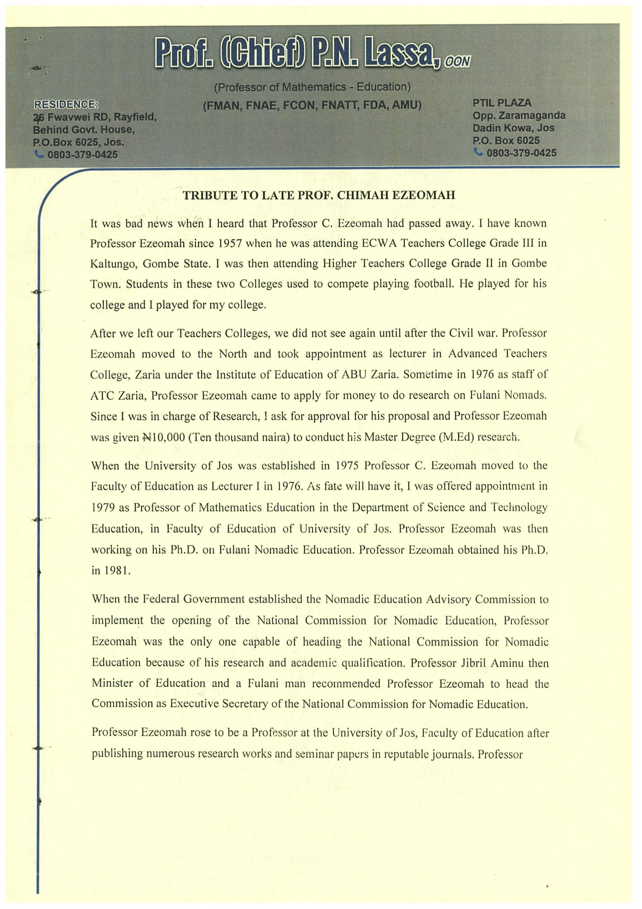
  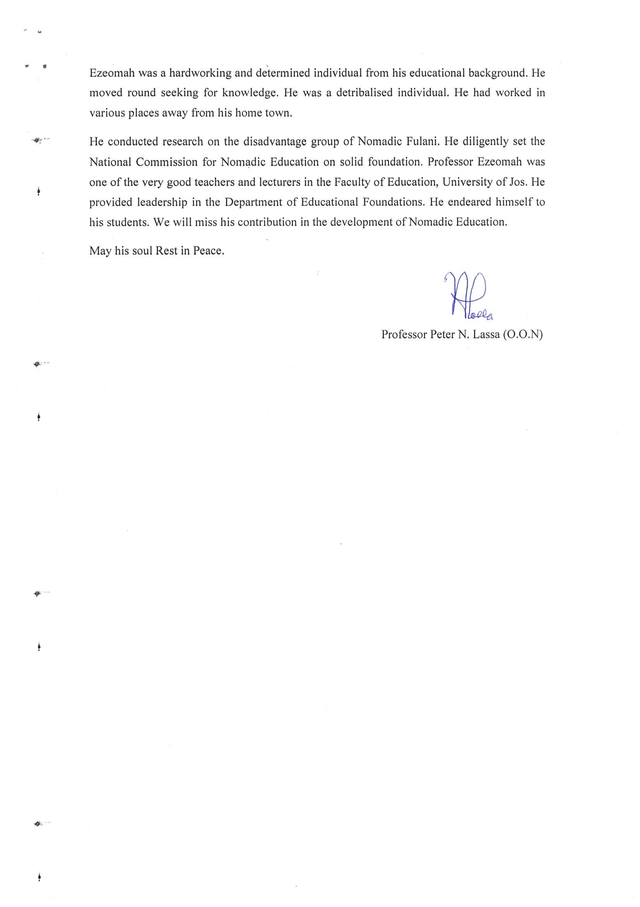

### Prof. Monday Mangvwat

  

    <strong>TRIBUTE TO A HIGHLY RESPECTED SCHOLAR AND EDUCATIONIST:</strong> 
    THE LATE PROFESSOR CHIMAH EZEOMAH (”ARDO”) OF UNIJOS.
  

 

As I put down these few words of tribute to the late senior colleague. I imagine what might have been his last words with his Maker, thanking Him for living a fulfilled life? I imagine so. Surely, at the University of Jos, to which he devoted over 90% of his quality life, the late professor C. Ezeomah (”Ardo”) made a tremendous impact on that University both institutionally and individually. Having attained the rank of Professorship, which made him an automatic member of the senate—the highest academic body of the University—he, in addition, held several key positions of responsibility within the University. For example, at various periods he was Head of Department of Arts and Social Sciences Education; Dean of Education; Director and Head of Research, Centre for Nomadic Education (on which I’ll say a little more); and Senate Representative on the Governing Council of the University – the highest policy–making body of the university. All these were in addition to his normal teaching and research responsibilities, including project supervision of students at both undergraduate and postgraduate levels, not to mention mentoring of younger academics undergoing tutelage. It is in the process of successfully discharging these critical responsibilities in the university that Professor Ezeomah, in my view, must have felt fulfilled before his Creator. Humanly speaking and on account of what I personally knew of him, along with testimonies from other colleagues, I believe this to be the case. What more would we want from him? He came; he saw; and he conquered!!!
                    
Yet, there is still a particularly unique area of intellectual, academic, and practical area of scholarship, research, and practice attributable to him which posterity should acknowledge. This is in the area of NOMADIC EDUCATION, which I mentioned earlier: Only God Almighty, through Prof. Ezeomah’s intellectual curiosity, would understand why a typical Igbo Professor from Abia State of Nigeria would devote so much intellectual energy to try to understand and assist the Nigerian Fulani way of life. This is why he became known as Ardo – a Fulbe word for Fulani Clan headman or leader. His doctoral thesis focused on developing strategies for the education of cattle Fulani communities in Nigeria. This work became the foundational reference base for developing policy and programme initiatives pertaining to the education of Fulani nomads and other mobile pastoralist groups in Nigeria in the 1970s and 1980s. He personally led significant and landmark studies on Fulani access to schooling and curriculum design. In recognition of his pioneering work on Fulani nomadic education, he was invited to serve on several international bodies dealing with pastoralist and nomadic education, and he was appointed the pioneer Executive Secretary, National Commission for Nomadic Education. This Commission itself came into being as part of his recommendation to the Federal Government, keenly supported by Professor Jibril Aminu and Professor Babs Fafunwa, who were successive Federal Ministers of Education under whom he served.
                     
Amidst other intellectual and academic exploits of Professor Chimah Ezeomah, which, I believe, are documented in his curriculum vitae, the one thing for which he earned both national and global recognition is NOMADIC EDUCATION symbolized by his popular title of ARDO, explained earlier. Nomadic education, which, without doubt, was an intellectual feat, brought Professor Ezeomah into the limelight, much as it promoted the intellectual and academic profile and image of the University of Jos. It is on account of this, in particular, that I feel compelled to put down these few lines of tribute to him as a former Vice Chancellor of the University.
                     
Well done ARDO!!!  REST IN PERFECT PEACE.
                                                                                              
**Professor Monday Y. Mangvwat** 
                                                                                                
*(Former Vice Chancellor-University of Jos) (2000 - 2006)*

                                                                                                

### Prof. John Idoko

  

    <strong>TRIBUTE TO PROFESSOR ARDO CHIMAH EZEOMAH</strong>
  

 

It is an honor to write this tribute to Ardo Chimah Ezeomah, a former senior colleague, husband, father, and grandfather.
I first met Professor Ezeomah when I was the Deputy Vice Chancellor of the University of Jos in the mid 90s when he was leading the national eductianal programme for nomadic fulanis. He was a wam gentleman, very amiable and full of humour. With time, we discovered that we were neighbours at the Senior Staff Quarters and our children became friends and playmates.

Professor Ezeomah was very committed to improving the educational fortunes of the nomadic fulani across the country and the program led to the graduation of nomadic fulanis at secondary and tertiary levels across the nation particularly in Northern Nigeria where they were most concentrated. No wonder he was crowned “Ardo” by the fulani communities across the nation.

Professor Ezeomah was a good man, full of humour, kind hearted, generous and real. He was a loving and caring husband and a wonderful father to his children. I am glad that he laid a strong and solid foundation for them and I am sure that all his children will live great lives full of his values and wishes. His beautiful spirit will live on through his children and they will always remember how much he loved them.

Professor Ezeomah has lived a good life and left behind many legacies for his family, his mentees, the academic community he served, the fulani communities across the country and all those whose lives he touched. 

The loss is there–tangible and real within everyone–but Professor Ezeomah exemplified life, love, laughter, and an irrepressible belief and faith in seeing the best in everything.

And so, today we honor him by profoundly feeling and expressing our loss, but also by remembering Professor Ezeomah as an amazing person who has played a unique and special role in all of our lives.

“We wish you farewell in your journey to eternity”. “Ardo, you will be in our hearts and memories”. “It was a privilege for us to have been a part of your life”. 

**Professor John Idoko,**

*Former Deputy Vice Chancellor (1994 - 1998), University of Jos,*

*Former Director General, National Agency for the Control of AIDS*
 

### Prof. Joseph Maina Musa, FPEAN

  

    <strong>TRIBUTE</strong>
  

 

As the immediate passed Dean of the Faculty of Education, I deem it fit to drop some few lines as tribute to late Prof. Ezeomah who was in the Educational Management Unit , Department of Educational Foundations , Faculty of Education , University of Jos.

  As a one time Director of Nomadic Education , he was honored with the Fulani title of "Ardo". As the Director and Ardo , Prof Ezeomah left no stone unturned in ensuring that Fulanis gained access to quality Western education. His efforts yielded much harvest as he presented Fulani university graduates to the University of Jos community.
  
  As a former dedicated lecturer, Dean of Faculty and Director among other sensitive responsibilities that he held, it becomes crystal clear that late Prof. Ezeomah has contributed immensely to the progress of his unit, department, faculty and the University.
  
   As he has departed this world to the great beyond, we fervently pray that may God Almighty in His infinite mercy grant him merciful judgement and rest his gentle soul in peace. Amen.
   
   Adieu Prof. Ezeomah.

**Prof. Joseph Maina Musa, FPEAN.**

*Former Dean Faculty of Education (2021 to 2024)*

### Jason Pennells

  

    <strong>Memories of Prof Ardo Chimah Ezeomah</strong>
  

  
By

From Jason Pennells

4 November 2025

I was saddened to hear of the recent death of my friend and former colleague, Prof Ardo Chimah Ezeomah. However, I feel this is a time predominantly for celebration of his long life well lived: Chimah was already a senior statesman in the field of nomadic education in Nigeria by the time he and I first met and started working together nearly three decades ago, in 1997. He had by then made his mark professionally, as well as in his personal family life.

Our working and personal relationship grew and evolved from an initial, potentially single, meeting, when I was asked to come to Nigeria for a one-week familiarisation and planning visit in order to design a month’s study tour and course in the UK for a small group of Nigerian educators who were to be involved in developing a programme to train basic teachers for nomadic youth. This was part of a community education project of the British Council with UK (Overseas Development Administration, ODA) funding support.

I met Chimah at the British Council office in Kano, and we spent a week going first to Maiduguri, where the teacher education centre of the National Commission for Nomadic Education (NCNE) was based at the University, and then, from word-of-mouth recommendation, down to Yola, to visit the Federal College of Education (FCE). That week led initially to our planning and designing the one-month programme in UK, which I coordinated. It also laid the foundations for our subsequent relationship and work on that project and for our other collaborations that followed. The participants of that short course in UK, drawn from faculty members of Unimaid and FCE Yola, formed the core of our working team, along with the British Council’s project manager, head of the district education office in Numan.

So, from my introduction to Chimah, I received my orientation to the world of nomadic education and specifically its history, context, aims and challenges in Nigeria. Chimah was the ideal mentor, being in many senses the ‘father of nomadic education’ in the country, as the first Executive Secretary of the NCNE and as author of papers and books on the subject, documenting migration patterns, experiments with mobile schools and much else. His status among the nomadic Fulbe (Fulani) reflected in his honorary title Ardo (leader) was his proudest professional honour.

At that time, UK government was not working directly with the Federal Government of Nigeria, for political reasons (it was the time of the Abacha government), but we were free to work with the Federal Colleges of Education and with the State Primary Education Boards, which we proceeded to do. Most importantly, we worked with the nomadic communities. The project was a ‘community education project’ not in the sense of a top-down delivery of education services to communities, but in being structured around a base of community education committees, where the nomadic leaders discussed, made decisions and approved the way forward for project interventions.

Chimah was a proud Igbo, and was fierce and determined in that identity: he retold the story of one bureaucratic tussle where, facing what he perceived as an unjustified blockage or misdirection of resources,  he had told his opponent that as he, Chimah, had fought as a Captain in the bush during the Biafran war, he would not be intimidated by opposition in a meeting.

It was notable, therefore, that Chimah devoted his professional and academic life very largely to the cause of the welfare and education of the nomadic Fulbe (as well as migrant fisherfolk). He only left his base at University of Jos and moved back southwards, taking his young children out of school to go with him, following an inter-communal conflagration in the city and reaching into the campus, which, amid rising tensions, made him feel it was too perilous to stay.

Chimah felt strongly and advocated for the need for nomadic cattle-herding pastoralists to have gazetted grazing reserves. This was to secure the livelihoods of the pastoralists, to facilitate the development of infrastructure and services for them, and to avoid the frequent conflicts between pastoralists and sedentary farmers arising from cattle herds trampling and eating crops and competing for water. Chimah noted the efforts at negotiated symbiosis of the Savannah Sugar Company in Adamawa, where the cattle arrived and grazed the stubble after the sugar crop had been harvested, thus fertilising the land with cattle dung, to the benefit of the growers. However, more commonly across the rangelands where pastoralists and their livestock lived and migrated, there were tensions and sometimes violent conflicts arising from competition for land and water resources. Chimah was acutely aware of the social prejudices and injustices often suffered by Fulbe, such as being the only ones among the passengers on a public minibus to be searched and questioned at a police roadblock.

Chimah was always generous to me, as to others, with his anecdotes, ideas, knowledge and questions. We spent many hours on long road journeys between Abuja, Kano or Jos and Yola, and more locally from Yola down to Jalingo, or to the local education office in Numan. During these journeys, we would discuss nomadic education, project issues and ideas, and much else. Our discussions and sometimes laughter would continue in the evenings, over dinner, which for Chimah was invariably his favourite cow-tail soup with pounded yam.

For the first community education project, the nomadic communities selected the young people who would participate in the course, which was designed to prepare them to teach their peers. The idea was that these young teachers would be more effective than teachers drafted into nomadic schools from outside, since they were themselves based within the nomadic community, culture, and lifestyle, and supported by their communities. The course materials were developed by our team of Maiduguri and Yola faculty, through a series of workshops held at the FCE and visits for discussions with the nomadic elders and communities whose members would be the students, and the teaching was delivered on a residential basis at FCE Yola to a cohort of young Fulbe.

That ODA-funded project was short-term, for a proof of concept, supporting the conception, development, and a single cycle of implementation of the teacher preparation course. This experience was documented in a chapter Chimah and I co-wrote, with two other colleagues who were involved in a different aspect of the community education project, and in due course was published internationally.

Chimah and I also worked together on a UK Department for International Development (DFID)-funded study on nomadic education issues and policy implications, in a team with members of the Maiduguri/Yola group, NCNE, and a colleague from NCNE’s migrant fisherfolk centre in Port Harcourt. This study included two conferences held in Abuja with wider participation, including education organisations in Nigeria, pastoralist NGOs, and guests with engagement in nomadic education from Sudan and Kenya.

The last time I passed through Jos with Chimah, he took me to a tailor and had an Igbo suit made for me. I was delighted later to have the opportunity to wear this for the evening of a British Igbo wedding. Sadly, Chimah and I never undertook our planned trip over the Mambilla Plateau after a work visit to Adamawa and Taraba, to visit his home in Abia State. Nevertheless, I hold in my mind his voice, his laughter, his piercing look, the warmth of his greeting each time we met, and his generosity of spirit. I cheer his commitment to the cause of the education and welfare of nomadic people. I feel privileged to have known and worked with Professor Ardo Chimah Ezeomah, and to have counted him as a friend.

### Prof. Gilbert C. Okechukwu

  

    <strong>Prof. Chimah Ezeomah - A Tribute</strong>
  

 

I write to express my sorrow at the passing and loss of my friend and colleague – Prof. Chimah Ezeomah (B. Ed., M.Ed., Ph. D.), Prof. of Education at the University of Jos, Plateau State. 

I met Prof. Chimah Ezeomah some 40 years ago at Jos when we became lecturers and later, Professors – Prof. Ezeomah in the Faculty of Education, and I, in the Faculty of Environmental Sciences. 

Prof. Ezeomah is to be remembered for being someone to depend on; someone who made every day much better. But above all, Prof. Ezeomah is to be remembered for his research and scholarship. He created a paradigm for the education of groups with special problems – a paradigm he introduced into the Nigerian educational system that attracted many scholars at Jos, and the Federal Ministry of Education. The paradigm demonstrated for the education of Fulbe, Fulani, coupled with the Professor’s hard work, dedication, and passion germinated into practical education of the nomadic Fulani and the curriculum of Nomadic Education in Nigerian universities. 

Prof. Chimah Ezeomah was my neighbour at the Narraguta Permanent Site Staff Quarters of the University of Jos, and my family is deeply touched by his death. I wish the Ezeomah family will take heart, and pray that God, in His infinite mercy, grant Chimah peace and eternal rest. 

**Prof. Gilbert C. Okechukwu**

### Prof. Akueshi

  

    <strong>Tribute to a Departed Friend</strong>
  

 

One of South Africa’s finest sons and, indeed, the world’s most admired leader of the later 20th century captured the inevitability of death when he said of himself, “Death is something inevitable. When a man has done what he considers to be his duty to his people and his country, he can rest in peace. I believe I have made that effort, and that is, therefore, why I will sleep for eternity.” (Nelson Madela, 1994). 

I can imagine that Prof. Ardo Chimah Ezeomah must have thought like this in the last few months of his life while battling with age-related ailments. Prof. Ezeomah, undoubtedly, lived a fulfilled and well-accomplished life. He served his family, his community, the University of Jos, and his country, Nigeria, faithfully and meritoriously. Prof. Ezeomah was very humble and simple, and enjoyed life with quiet dignity that eschews every form of ostentation. Indeed, his mien was pervaded with humanity. 

Our professor was a dedicated teacher and keen researcher. He has mentored and supervised scores of students, undergraduate and postgraduate. 

He initiated the curriculum for Nomadic Education at the University of Jos. 
He has held many administrative positions at the University of Jos and beyond including: 
1.	Dean, Faculty of Education
2.	Pioneer Executive Secretary, National Commission for Nomadic Education.

Those who have encountered Prof. Ardo Chimah Ezeomah will readily attest that he was very keen and conscientious in every assignment set before him. He was industrious and trustworthy, and an epitome of diligence and faithfulness.

Unfortunately, the cold hands of death have snatched this gentleman from us. Yet, in the words of Quintus Ennius, “Let no one weep for Prof. Ezeomah or celebrate his funeral with mourning, because this faithful servant of God still lives on in our daily thoughts.” 

Prof. Ezeomah is gone, but his legacies still endure. May God grant his gentle soul a peaceful repose, and give the Ezeomah family, friends, in-laws, and well-wishers the fortitude to bear this sad loss. 

**Prof. and Mrs. Chiedo O. Akueshi.**

### Prof. J. Nnamdi Aduba

  

    <strong>FAREWELL TO PROF CHIMAH EZEOMAH (ARDO)</strong>
  

 

Writing about an elderly friend in the past tense is sad but one is comforted by the fact that he lived a very fulfilled life having surpassed the proverbial 70 years. 

The iroko has fallen indeed. By the time I knew him in1990, he was already a professor, a reknowned one indeed. A leading expert in nomadic education. Our friendship was on a social level when I was the chairman of the University of Jos Staff club where most academics gather to relax. 

He told me a lot about his early childhood, struggles in the teaching profession and appointment as the first executive secretary of the National Commission for Nomadic Education in Nigeria. He later became the leader of the Igbos in the university under the ‘Mahadum’ of which I was a member. 

He was soft spoken, highly articulate, and patient. His diction was flawless. We grew close and I sometimes dropped him in his house after meetings. We still kept in touch after his retirement. He visited once and we kept in touch until the phone calls went silent. 

It was with heavy heart that I received the news that he has gone to be with his maker. He came, he saw and he conquered. His passage should be a celebration because he gave his all to humanity. He will be missed. 
May God welcome him into paradise. Adieu Ardo.

**Prof  J. Nnamdi Aduba (Nnabuenyi).**

### Professor Ihenacho Izuka John

  

    <strong>ODE TO THE GRAND COMMANDER OF INTELLIGENCE, PROFESSOR CHIMAH EZEOMAH</strong>
  

  
By

PROFESSOR IHENACHO IZUKA JOHN, UNIVERSITY OF JOS

The legend of the legends and the Professor of the Professor of professors. Professor Chimah Ezeomah is an individual worth millions of individuals. He exuded strength and poured out energy that surpassed the ordinary human strength which showed in his lectures. I met him as a Youth Corper at the University of Jos. He was already an Associate Professor when the rest of his senior mates were writing strugglers. A few years later, he ascended the stool of professorship in grand style. One can hear the mullings of his past and current students calling him an intellectual workaholic. One can see Professor Ezeomah coming out from his office and lecture halls with groups of students following him in batches tapping from his further explanatory notes, the ideas which quite often few are rarely found in textbooks but are in the textbook of life experiences acquired over time. 

I admired him a lot. 

As I went closer and closer to him to study his intellectual ways, he metamorphosed into an international researcher, winning research grants not only from the senate of the University of Jos, also from UNESCO/UNDP to mention but few. One of the uniqueness of Professor Chimah Ezeomah’s researches is its originality in field context. He spent most of his time in the actual research field with young growing intelligent fact finders and harvesters of wisdom. When you see Professor Chimah, you will notice that he usually has brief discussions to save time for his research. He did not have time for gossips and petty talks for putting people down. He was an optimist. He was one of those whose fame brought University of Jos to national and international fame. He discovered and collected facts about the lives and times of the Fulani Nomads. His strategic field works took some of us to the then Gongola state for months digging up originalities. His research findings gained him world fame and made the Federal Government of Nigeria create the National Commission for Nomadic Education. The Government respectfully appointed him the first Executive Secretary to this National Commission. Senate of the University of Jos equally approved and created the unit of Nomadic Education. Federal Government to date created a separate national budget code for Nomadic Education from then to date. By this singular achievement, Professor Chimah Ezeomah opened a wide door that has employed many Nigerians in all the States Ministries of Education.

In conclusion, Professor Chimah Ezeomah was an accomplished researcher, noble Head of Department, Dean of Education, Permanent Senate Member of the University of Jos, State Advisor on Nomadic Education and an intellectual legend whose writings are on the resource reserved shelves at the National and State libraries both in Nigeria and abroad. This legend will not be forgotten so soon. 

*Signed:* 

*Professor Ihenacho Izuka John*

*University of Jos*

### Prof. Godwin Owoicho Akpa, Ph.D. 

  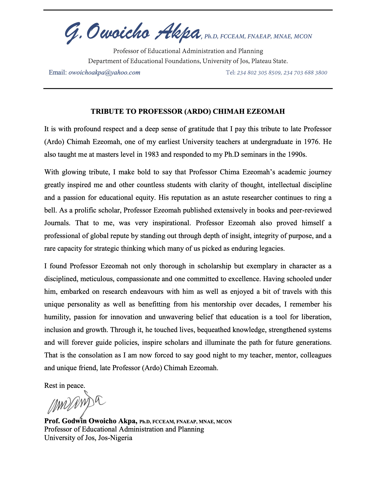

### Prof. Adamu I. Ayiya Obiukwu

  

    <strong>TRIBUTE TO A QUINTESSENTIAL ACADEMIC IROKO</strong>
  

 

I find it very difficult and heart-breaking to write your tribute. In remembrance of the fulfilled life that God blessed you with, my childhood memory of your early life was when you brought the Army Band to play in Umuezehiri Hall when you were a Captain of the Biafran Army, which I had never seen before.

Our ways crossed again at the University of Jos, where you embedded your scholarly name as the FIRST Professor of Nomadic Education in Nigeria. You were my mentor who always encouraged me with your usual advice of “Nwanna anyi idi kwani Ole,” which has constantly kept me on my toes, bearing in mind my humble background. You have lived a fulfilled life and left indelible marks in many aspects of life and in the sand of time. 

ADIEU MY MENTOR.

**Professor Adamu I. Ayiya Obiukwu**

### Prof. Okeahialam

  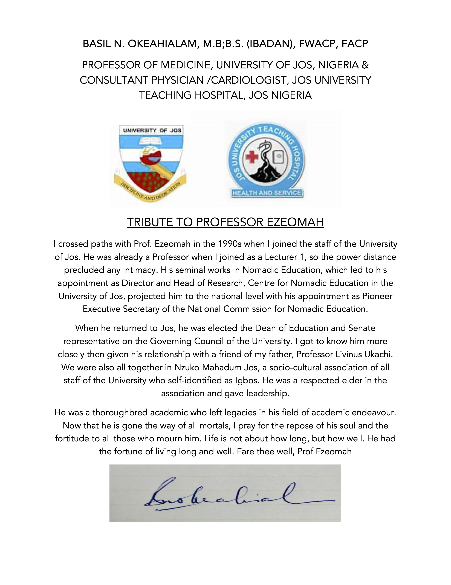

### Dr. James Bature 

  

    <strong>A TRIBUTE TO PROFESSOR CHIMAH EZEOMAH</strong>
  

 

I walked into your life as a supervisee, not knowing what will befall me. No sooner the engagement between a supervisor and supervisee started, did the attributes of the supervisor in you begin to manifest. You were very thorough, patient and accommodating but not tolerating laziness nor accepting sub-standard presentations. You were very accessible, in spite of the quantum of work around you. You acknowledged my visits to you both in the office and at your home; and attended to me soon thereafter. I did not take your humility and accepting me into your family for granted. You were indeed a mentor and not just a supervisor. The impact you made in my life will long be remembered and appreciated. 
Rest in Peace Prof. Chimah Ezeomah

*Dr. James Bature*

### Kayode Sanni 

  

    <strong>Tribute to Professor (Ardo) Chimah Ezeomah</strong>
  

 

A Life of Commitment – ensuring that generations of children always on the move are never left behind. I am honoured to honour the cherished memory of Professor (Ardo) Chimah Ezeomah—renowned scholar, indefatigable teacher, and relentless pioneer whose life’s work on education of nomadic peoples changed how Nigeria, and other nations with pastoralist terrains and populations, think about educating children who travel with the seasons.

Throughout his journey of service, Prof. Ezeomah carried himself with distinction, uniquely blending the intellectual rigour of life in academia with (unusual for academics) deep cultural empathy built from breathing and living in step with his research participants. He always listened first—to pastoralist families, to teachers on dusty roads with no resources, to officials wrestling with policy—and helped build bridges between them. His scholarship on nomadic education gave language, data, and dignity to communities too often left out of the school map. From his years at the University of Jos to his influential work with UNESCO and Nigerian education authorities, he insisted that learning must go to the child wherever she may be, not the other way round.

His books and papers were essential reading in the discourse. He documented the issues, but also offered practical solutions: mobile schools, context-relevant curricula, teacher preparation for life on the move, and policies that respect culture while expanding opportunity. Generations of researchers and programme designers cite his work for the clarity, courage, and compassion it brings to a complex challenge of our modern times.

To his students and colleagues, he was a mentor; to the families he served, an advocate; to many of us, a moral compass reminding us that education is a right wherever a child lays their head at night. His legacy endures in every classroom tent that rises with the herd, in every teacher trained to teach under open skies, and in every child from a nomadic family who learns to read, count and dream because the system finally reached them.

We commend his gentle spirit and towering intellect to God, and we aspire to carry forward the work he began. Farewell, Prof. Ezeomah. May the roads you championed for learners now lead you to perfect rest and peace. Amen.

*—	Kayode Sanni, 3 Nov 2025*

### Dr. Damina Mohammed Sadiq

  

    <strong>Tribute to Late Prof. Ardo Chimah Ezeomah: The Father of Nomadic Education in Nigeria.</strong>
  

 

Prof. Ardo Chimah Ezeomah was a household name among nomadic Fulani communities in Nigeria as he was the master key that granted them access to formal education through the establishment of nomadic education in Nigeria. He was a father and pillar to every nomadic child in the country and today we are sadly mourning the passing of a loving and caring father. He committed his entire life to ensuring people were treated equally without regard to their tribe, religion or family background and this was the reason that led him to the idea of a special education programme for the nomads due to their transhumance nature and inability to access the conventional system of education. 

Dear Prof., I remember very well how you personally drove me in your car from Jos to Maiduguri just to secure admission for me to study veterinary Medicine at the University of Maiduguri. Today, I proudly say that I am a trained veterinarian working at the famous National Veterinary Institute, Vom, Plateau State, as you ensured I never lacked anything throughout my study period. e are all witnesses that you lived your entire life loving and supporting others, and you lived to shine the light on the nomadic children in Nigeria who have been left in the dark for decades.
Even though you have gone to be with your creator, I know you can hear my cry, I know you can hear my prayers for you and we assure you that your love and kindness will live with us and you will never be forgotten. I pray that God almighty comfort and take care of your immediate family you left behind, the academia and the nomadic families across Nigeria. Sleep well my dear Ardo.

Prof. was a caring dad to all of us. I pray and hope that we all will be able to emulate him even if not all, but some of his attributes.

**Dr. Damina Mohammed Sadiq**

*National Veterinary Research Institute, Vom*

*Plateau State*

### Nzuko Mahadum

  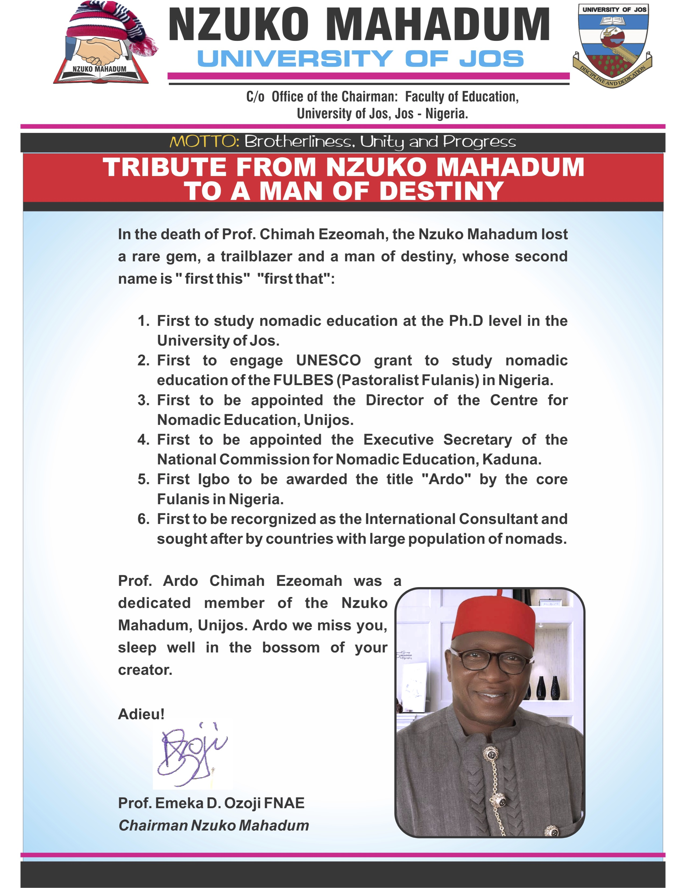

### University of Nigeria, Nsukka Alumni Association

  

### University of Jos Alunmi Association

  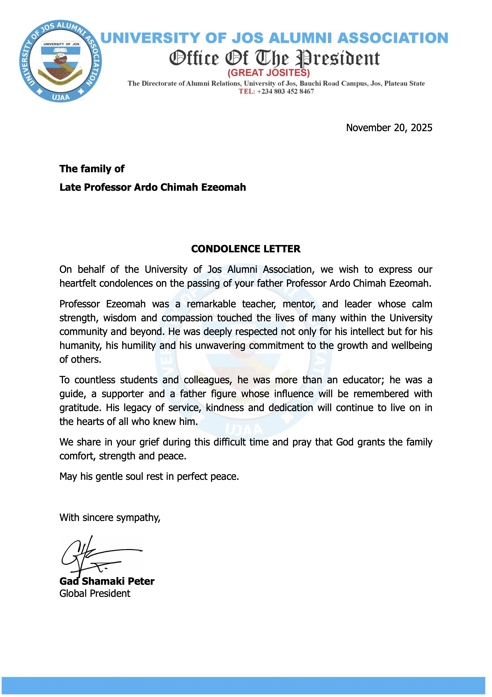

